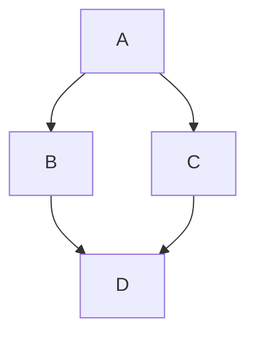

# Heading Styles

# Heading 1
## Heading 2
### Heading 3
#### Heading 4
##### Heading 5
###### Heading 6

---
## Lorem Ipsum
Eu incididunt exercitation voluptate irure aute. In in mollit adipisicing duis. Aliqua aliqua ut eu id.

Duis exercitation laboris amet amet tempor anim ex. Lorem ut incididunt aliquip eu irure. Commodo sint labore ipsum pariatur officia magna enim aute ad quis. Ullamco est exercitation ipsum culpa aliquip Lorem fugiat ad nostrud. Ea et enim consequat et quis consequat minim.

Ipsum quis officia ut amet dolor velit fugiat tempor nostrud occaecat duis eiusmod. Irure id nulla velit ipsum. Minim fugiat exercitation deserunt minim.

## Text Formatting

**Bold Text**

*Italic Text*

***Bold and Italic***

~~Strikethrough~~

> Blockquote example

`Inline code`

```
Code Block Example
```

```bash
# Code block with syntax highlighting
echo "Hello, World!"
```

```json
{
  "key": "value",
  "number": 123
}
```

---

## Lists

### Unordered List

- Item 1
- Item 2
  - Sub-item 1
  - Sub-item 2

### Ordered List

1. First item
2. Second item
   1. Sub-item 1
   2. Sub-item 2

### Nested Mixed List

- Item 1
  1. Sub-item A
  2. Sub-item B
- Item 2
  - Sub-item X
  - Sub-item Y

---

## Links & Images

[Hugo Website](https://gohugo.io/)


---

## Tables

| Column 1 | Column 2 | Column 3 |
|----------|----------|----------|
| Data 1   | Data 2   | Data 3   |
| Data 4   | Data 5   | Data 6   |
| **Bold** | *Italic* | `Code`   |

---

## Task List

- [x] Task 1
- [ ] Task 2
- [ ] Task 3

---

## Footnotes

Here is a sentence with a footnote.[^1]

[^1]: This is the footnote explanation.

---

## Definition List

Term 1
: Definition 1

Term 2
: Definition 2

---

## Horizontal Rules

---

***

___

---

## Emojis

🚀 💡 🔥 🎉 😃

---

## HTML in Markdown

<div style="color: red; font-weight: bold;">This is HTML inside Markdown!</div>

---

## Escaping Characters

\*This is not italic\*

\# Not a heading

---

## Subscript & Superscript

H~2~O (Subscript)

X^2^ (Superscript)

---

## Automatic Links

<https://gohugo.io/>

---

## Abbreviations

Markdown converts HTML, CSS, and JS into web pages.

*[HTML]: HyperText Markup Language
*[CSS]: Cascading Style Sheets
*[JS]: JavaScript

---

## Custom Containers (Hugo-specific but works in Markdown)

::: warning
This is a warning box!
:::

::: info
This is an info box!
:::

---

## Math Equations (LaTeX / MathJax)

### Inline Math

Euler's formula: $e^{i\pi} + 1 = 0$

Pythagorean theorem: $a^2 + b^2 = c^2$

### Block Math

$$
\int_{a}^{b} x^2 \,dx = \frac{b^3}{3} - \frac{a^3}{3}
$$

$$
F(x) = \sum_{n=0}^{\infty} \frac{f^{(n)}(a)}{n!} (x - a)^n
$$

Quadratic formula:

$$
x = \frac{-b \pm \sqrt{b^2 - 4ac}}{2a}
$$

---

## Underlined Text (Using HTML)

<u>Underlined Text</u>

---

## Keyboard Shortcuts

Press `Ctrl` + `C` to copy.

---

## Spoiler (HTML workaround)

<details>
  <summary>Click to reveal</summary>
  Hidden content here!
</details>

---

## ASCII Art

```
  /\_/\  
 ( o.o ) 
 > ^_^ < 
```

---

## Mermaid Diagrams (If enabled in Hugo)



```goat
      .               .                .               .--- 1          .-- 1     / 1
     / \              |                |           .---+            .-+         +
    /   \         .---+---.         .--+--.        |   '--- 2      |   '-- 2   / \ 2
   +     +        |       |        |       |    ---+            ---+          +
  / \   / \     .-+-.   .-+-.     .+.     .+.      |   .--- 3      |   .-- 3   \ / 3
 /   \ /   \    |   |   |   |    |   |   |   |     '---+            '-+         +
 1   2 3   4    1   2   3   4    1   2   3   4         '--- 4          '-- 4     \ 4

```

---

## Sound Embed (HTML workaround)

<audio controls>
  <source src="sound.mp3" type="audio/mpeg">
  Your browser does not support the audio tag.
</audio>

---

## Video Embed (HTML workaround)

<video width="320" height="240" controls>
  <source src="video.mp4" type="video/mp4">
  Your browser does not support the video tag.
</video>

## Python Example
```python
import numpy as np
import random
from math import exp, sqrt
from typing import List, Tuple, Callable
import matplotlib.pyplot as plt
from collections import defaultdict

# Dekorator untuk mengukur waktu eksekusi
def timing_decorator(func):
    import time
    def wrapper(*args, **kwargs):
        start = time.time()
        result = func(*args, **kwargs)
        end = time.time()
        print(f"{func.__name__} executed in {end-start:.4f} seconds")
        return result
    return wrapper

# Fungsi aktivasi dan turunannya
def sigmoid(x: float) -> float:
    return 1 / (1 + exp(-x))

def sigmoid_derivative(x: float) -> float:
    s = sigmoid(x)
    return s * (1 - s)

# Kelas Neuron
class Neuron:
    def __init__(self, weights: List[float], bias: float):
        self.weights = weights
        self.bias = bias
        self.activation = 0.0
        self.error = 0.0

    def activate(self, inputs: List[float]) -> float:
        total = sum(w * i for w, i in zip(self.weights, inputs)) + self.bias
        self.activation = sigmoid(total)
        return self.activation

# Kelas Layer
class Layer:
    def __init__(self, num_neurons: int, num_inputs: int):
        self.neurons = [Neuron([random.uniform(-1, 1) for _ in range(num_inputs)], 
                              random.uniform(-1, 1)) 
                       for _ in range(num_neurons)]

    def forward(self, inputs: List[float]) -> List[float]:
        return [neuron.activate(inputs) for neuron in self.neurons]

# Kelas Neural Network
class NeuralNetwork:
    def __init__(self, layer_sizes: List[int]):
        self.layers = []
        for i in range(1, len(layer_sizes)):
            self.layers.append(Layer(layer_sizes[i], layer_sizes[i-1]))

    def forward(self, inputs: List[float]) -> List[float]:
        for layer in self.layers:
            inputs = layer.forward(inputs)
        return inputs

    def get_weights_and_biases(self) -> Tuple[List[List[List[float]]], List[List[float]]]:
        weights = []
        biases = []
        for layer in self.layers:
            layer_weights = [neuron.weights for neuron in layer.neurons]
            layer_biases = [neuron.bias for neuron in layer.neurons]
            weights.append(layer_weights)
            biases.append(layer_biases)
        return weights, biases

    def set_weights_and_biases(self, weights: List[List[List[float]]], biases: List[List[float]]):
        for layer_idx, layer in enumerate(self.layers):
            for neuron_idx, neuron in enumerate(layer.neurons):
                neuron.weights = weights[layer_idx][neuron_idx]
                neuron.bias = biases[layer_idx][neuron_idx]

    def calculate_loss(self, dataset: List[Tuple[List[float], List[float]]]) -> float:
        total_loss = 0.0
        for inputs, targets in dataset:
            outputs = self.forward(inputs)
            total_loss += sum((o - t)**2 for o, t in zip(outputs, targets))
        return total_loss / len(dataset)

# Algoritma Genetika
class GeneticAlgorithm:
    def __init__(self, 
                 population_size: int, 
                 mutation_rate: float, 
                 crossover_rate: float,
                 network_structure: List[int],
                 dataset: List[Tuple[List[float], List[float]]]):
        self.population_size = population_size
        self.mutation_rate = mutation_rate
        self.crossover_rate = crossover_rate
        self.network_structure = network_structure
        self.dataset = dataset
        self.population = self.initialize_population()

    def initialize_population(self) -> List[NeuralNetwork]:
        return [NeuralNetwork(self.network_structure) for _ in range(self.population_size)]

    def evaluate_fitness(self, network: NeuralNetwork) -> float:
        # Fitness adalah kebalikan dari loss (semakin kecil loss, semakin besar fitness)
        loss = network.calculate_loss(self.dataset)
        return 1 / (loss + 1e-6)  # Tambahkan konstanta kecil untuk menghindari pembagian dengan nol

    def select_parents(self) -> List[NeuralNetwork]:
        # Seleksi turnamen
        tournament_size = max(2, self.population_size // 10)
        parents = []
        for _ in range(2):  # Pilih 2 orang tua
            contestants = random.sample(self.population, tournament_size)
            winner = max(contestants, key=lambda x: self.evaluate_fitness(x))
            parents.append(winner)
        return parents

    def crossover(self, parent1: NeuralNetwork, parent2: NeuralNetwork) -> NeuralNetwork:
        child = NeuralNetwork(self.network_structure)
        p1_weights, p1_biases = parent1.get_weights_and_biases()
        p2_weights, p2_biases = parent2.get_weights_and_biases()
        c_weights = []
        c_biases = []

        for layer_idx in range(len(p1_weights)):
            layer_weights = []
            layer_biases = []
            for neuron_idx in range(len(p1_weights[layer_idx])):
                if random.random() < self.crossover_rate:
                    # Ambil dari parent1 atau parent2 secara acak
                    if random.random() < 0.5:
                        layer_weights.append(p1_weights[layer_idx][neuron_idx])
                        layer_biases.append(p1_biases[layer_idx][neuron_idx])
                    else:
                        layer_weights.append(p2_weights[layer_idx][neuron_idx])
                        layer_biases.append(p2_biases[layer_idx][neuron_idx])
                else:
                    # Ambil dari parent1
                    layer_weights.append(p1_weights[layer_idx][neuron_idx])
                    layer_biases.append(p1_biases[layer_idx][neuron_idx])
            c_weights.append(layer_weights)
            c_biases.append(layer_biases)

        child.set_weights_and_biases(c_weights, c_biases)
        return child

    def mutate(self, network: NeuralNetwork):
        weights, biases = network.get_weights_and_biases()
        for layer_idx in range(len(weights)):
            for neuron_idx in range(len(weights[layer_idx])):
                for weight_idx in range(len(weights[layer_idx][neuron_idx])):
                    if random.random() < self.mutation_rate:
                        # Mutasi Gaussian
                        weights[layer_idx][neuron_idx][weight_idx] += random.gauss(0, 0.1)
                if random.random() < self.mutation_rate:
                    biases[layer_idx][neuron_idx] += random.gauss(0, 0.1)
        network.set_weights_and_biases(weights, biases)

    @timing_decorator
    def evolve(self, generations: int) -> Tuple[NeuralNetwork, List[float]]:
        best_fitness_history = []
        avg_fitness_history = []

        for gen in range(generations):
            # Evaluasi fitness
            fitness_scores = [self.evaluate_fitness(net) for net in self.population]
            best_fitness = max(fitness_scores)
            avg_fitness = sum(fitness_scores) / len(fitness_scores)
            best_fitness_history.append(best_fitness)
            avg_fitness_history.append(avg_fitness)

            # Elitisme: simpan individu terbaik
            elite = max(self.population, key=lambda x: self.evaluate_fitness(x))
            new_population = [elite]

            # Hasilkan keturunan
            while len(new_population) < self.population_size:
                parents = self.select_parents()
                child = self.crossover(parents[0], parents[1])
                self.mutate(child)
                new_population.append(child)

            self.population = new_population

            if gen % 10 == 0:
                print(f"Generation {gen}: Best Fitness = {best_fitness:.4f}, Avg Fitness = {avg_fitness:.4f}")

        # Plot hasil evolusi
        plt.figure(figsize=(10, 5))
        plt.plot(best_fitness_history, label='Best Fitness')
        plt.plot(avg_fitness_history, label='Average Fitness')
        plt.xlabel('Generation')
        plt.ylabel('Fitness')
        plt.title('Fitness over Generations')
        plt.legend()
        plt.grid(True)
        plt.show()

        best_network = max(self.population, key=lambda x: self.evaluate_fitness(x))
        return best_network, best_fitness_history

# Dataset XOR (input dan output yang diharapkan)
xor_dataset = [
    ([0, 0], [0]),
    ([0, 1], [1]),
    ([1, 0], [1]),
    ([1, 1], [0])
]

# Konfigurasi GA
population_size = 50
mutation_rate = 0.1
crossover_rate = 0.7
generations = 100
network_structure = [2, 4, 1]  # 2 input, hidden layer 4 neuron, 1 output

# Jalankan algoritma genetika
ga = GeneticAlgorithm(population_size, mutation_rate, crossover_rate, network_structure, xor_dataset)
best_network, fitness_history = ga.evolve(generations)

# Evaluasi jaringan terbaik
print("\nEvaluasi Jaringan Terbaik:")
for inputs, targets in xor_dataset:
    output = best_network.forward(inputs)
    print(f"Input: {inputs} -> Output: {output[0]:.4f} (Expected: {targets[0]})")

# Hitung akurasi
correct = 0
for inputs, targets in xor_dataset:
    output = best_network.forward(inputs)
    predicted = 1 if output[0] > 0.5 else 0
    if predicted == targets[0]:
        correct += 1
accuracy = correct / len(xor_dataset) * 100
print(f"\nAkurasi: {accuracy:.2f}%")
```
## C Example
```c
#include <stdio.h>
#include <stdlib.h>
#include <string.h>
#include <pthread.h>
#include <unistd.h>
#include <sys/socket.h>
#include <netinet/in.h>
#include <openssl/aes.h>
#include <time.h>

#define KEY_SIZE 32
#define IV_SIZE 16
#define MAX_CACHE 1024
#define PORT 8080
#define MAX_CLIENTS 10

typedef struct {
    int id;
    char name[50];
    double balance;
    unsigned char encrypted[64];
} Account;

typedef struct AVLNode {
    Account data;
    struct AVLNode *left;
    struct AVLNode *right;
    int height;
} AVLNode;

typedef struct {
    AVLNode* root;
    pthread_mutex_t lock;
    AES_KEY encrypt_key;
    AES_KEY decrypt_key;
    unsigned char iv[IV_SIZE];
} Database;

typedef struct LRUNode {
    int key;
    Account value;
    struct LRUNode *next;
    struct LRUNode *prev;
} LRUNode;

typedef struct {
    LRUNode *head;
    LRUNode *tail;
    int capacity;
    int size;
} LRUCache;

typedef struct {
    int sock;
    Database *db;
    LRUCache *cache;
} ClientArgs;

// Fungsi AVL Tree
int max(int a, int b) { return (a > b)? a : b; }
int height(AVLNode *N) { return N ? N->height : 0; }

AVLNode* rotateRight(AVLNode *y) {
    AVLNode *x = y->left;
    AVLNode *T2 = x->right;

    x->right = y;
    y->left = T2;

    y->height = max(height(y->left), height(y->right)) + 1;
    x->height = max(height(x->left), height(x->right)) + 1;

    return x;
}

AVLNode* rotateLeft(AVLNode *x) {
    AVLNode *y = x->right;
    AVLNode *T2 = y->left;

    y->left = x;
    x->right = T2;

    x->height = max(height(x->left), height(x->right)) + 1;
    y->height = max(height(y->left), height(y->right)) + 1;

    return y;
}

int getBalance(AVLNode *N) {
    return N ? height(N->left) - height(N->right) : 0;
}

AVLNode* insertNode(AVLNode* node, Account key) {
    if (!node) {
        AVLNode* newNode = (AVLNode*)malloc(sizeof(AVLNode));
        newNode->data = key;
        newNode->left = NULL;
        newNode->right = NULL;
        newNode->height = 1;
        return newNode;
    }

    if (key.id < node->data.id)
        node->left = insertNode(node->left, key);
    else if (key.id > node->data.id)
        node->right = insertNode(node->right, key);
    else
        return node;

    node->height = 1 + max(height(node->left), height(node->right));

    int balance = getBalance(node);

    if (balance > 1 && key.id < node->left->data.id)
        return rotateRight(node);

    if (balance < -1 && key.id > node->right->data.id)
        return rotateLeft(node);

    if (balance > 1 && key.id > node->left->data.id) {
        node->left = rotateLeft(node->left);
        return rotateRight(node);
    }

    if (balance < -1 && key.id < node->right->data.id) {
        node->right = rotateRight(node->right);
        return rotateLeft(node);
    }

    return node;
}

// Fungsi Enkripsi
void encryptAccount(Account *acc, Database *db) {
    AES_cbc_encrypt((unsigned char*)acc, acc->encrypted, sizeof(Account), &db->encrypt_key, db->iv, AES_ENCRYPT);
}

void decryptAccount(Account *acc, Database *db) {
    AES_cbc_encrypt(acc->encrypted, (unsigned char*)acc, sizeof(Account), &db->decrypt_key, db->iv, AES_DECRYPT);
}

// Fungsi LRU Cache
LRUCache* createCache(int capacity) {
    LRUCache* cache = (LRUCache*)malloc(sizeof(LRUCache));
    cache->capacity = capacity;
    cache->size = 0;
    cache->head = cache->tail = NULL;
    return cache;
}

void moveToHead(LRUCache* cache, LRUNode* node) {
    if (node == cache->head) return;

    if (node == cache->tail) {
        cache->tail = node->prev;
        cache->tail->next = NULL;
    } else {
        node->prev->next = node->next;
        node->next->prev = node->prev;
    }

    node->next = cache->head;
    node->prev = NULL;
    cache->head->prev = node;
    cache->head = node;
}

Account* getFromCache(LRUCache* cache, int key) {
    LRUNode* current = cache->head;
    while (current) {
        if (current->key == key) {
            moveToHead(cache, current);
            return &current->value;
        }
        current = current->next;
    }
    return NULL;
}

void putToCache(LRUCache* cache, int key, Account value) {
    Account* existing = getFromCache(cache, key);
    if (existing) {
        *existing = value;
        return;
    }

    LRUNode* newNode = (LRUNode*)malloc(sizeof(LRUNode));
    newNode->key = key;
    newNode->value = value;
    newNode->prev = NULL;
    newNode->next = cache->head;

    if (cache->head)
        cache->head->prev = newNode;
    else
        cache->tail = newNode;

    cache->head = newNode;
    cache->size++;

    if (cache->size > cache->capacity) {
        LRUNode* toRemove = cache->tail;
        cache->tail = cache->tail->prev;
        if (cache->tail)
            cache->tail->next = NULL;
        free(toRemove);
        cache->size--;
    }
}

// Fungsi Database
Account* search(AVLNode* root, int id) {
    if (!root) return NULL;
    if (id < root->data.id)
        return search(root->left, id);
    else if (id > root->data.id)
        return search(root->right, id);
    else
        return &root->data;
}

void handleClient(ClientArgs *args) {
    char buffer[1024];
    int read_size;
    
    while ((read_size = recv(args->sock, buffer, sizeof(buffer), 0)) {
        int command;
        memcpy(&command, buffer, sizeof(int));
        
        pthread_mutex_lock(&args->db->lock);
        
        switch(command) {
            case 1: { // Get account
                int id;
                memcpy(&id, buffer + sizeof(int), sizeof(int));
                Account *acc = getFromCache(args->cache, id);
                if (!acc) {
                    acc = search(args->db->root, id);
                    if (acc) {
                        decryptAccount(acc, args->db);
                        putToCache(args->cache, id, *acc);
                    }
                }
                send(args->sock, acc, sizeof(Account), 0);
                break;
            }
            case 2: { // Update account
                Account acc;
                memcpy(&acc, buffer + sizeof(int), sizeof(Account));
                encryptAccount(&acc, args->db);
                args->db->root = insertNode(args->db->root, acc);
                putToCache(args->cache, acc.id, acc);
                break;
            }
        }
        
        pthread_mutex_unlock(&args->db->lock);
    }
    
    close(args->sock);
    free(args);
}

void initDatabase(Database *db, const unsigned char *key) {
    AES_set_encrypt_key(key, 256, &db->encrypt_key);
    AES_set_decrypt_key(key, 256, &db->decrypt_key);
    memset(db->iv, 0, IV_SIZE);
    pthread_mutex_init(&db->lock, NULL);
    db->root = NULL;
}

int main() {
    int server_fd, new_socket;
    struct sockaddr_in address;
    int opt = 1;
    socklen_t addrlen = sizeof(address);
    
    Database db;
    unsigned char key[KEY_SIZE] = "secret_key_1234567890abcdef";
    initDatabase(&db, key);
    
    LRUCache *cache = createCache(MAX_CACHE);

    if ((server_fd = socket(AF_INET, SOCK_STREAM, 0)) == 0) {
        perror("socket failed");
        exit(EXIT_FAILURE);
    }
    
    if (setsockopt(server_fd, SOL_SOCKET, SO_REUSEADDR | SO_REUSEPORT, &opt, sizeof(opt))) {
        perror("setsockopt");
        exit(EXIT_FAILURE);
    }
    
    address.sin_family = AF_INET;
    address.sin_addr.s_addr = INADDR_ANY;
    address.sin_port = htons(PORT);
    
    if (bind(server_fd, (struct sockaddr *)&address, sizeof(address)) < 0) {
        perror("bind failed");
        exit(EXIT_FAILURE);
    }
    
    if (listen(server_fd, MAX_CLIENTS) < 0) {
        perror("listen");
        exit(EXIT_FAILURE);
    }
    
    while(1) {
        if ((new_socket = accept(server_fd, (struct sockaddr *)&address, &addrlen)) < 0) {
            perror("accept");
            continue;
        }
        
        ClientArgs *args = malloc(sizeof(ClientArgs));
        args->sock = new_socket;
        args->db = &db;
        args->cache = cache;
        
        pthread_t thread;
        pthread_create(&thread, NULL, (void *(*)(void *))handleClient, args);
    }
    
    return 0;
}
```